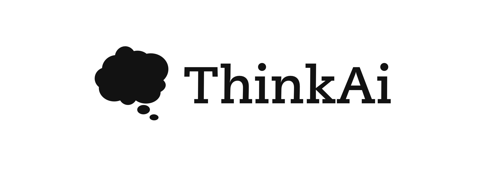

# ThinkAi UI

[ThinkAi](https://github.com/maanvithag/thinkai) is a Python-based LLM App trained on philosophy research that can answer questions on philosophy using Chroma's Vector Search, HuggingFace tokenizers for text chunking, Meta's `bart-large-cnn` model for summarizing, and OpenAI's `gpt-3.5-turbo` model for structuring the final response.

# Basic User Flow:
Here is how ThinkAi processes each user query;
* User pings the [web client](http://thinkai.live/) with a query.
* Chroma DB creates embeddings for this query
* Using vector search, Chroma DB pulls the closest top 3 articles for the query
* The summaries for these articles is pulled from the preprocessed `JSON` file from below and are combined by simple concatenation
* The combined text is included in prompt for `OpenAI GPT model`
* API call to OpenAI `gpt-3.5-turbo` model and get response
* Response is sent back to the user

